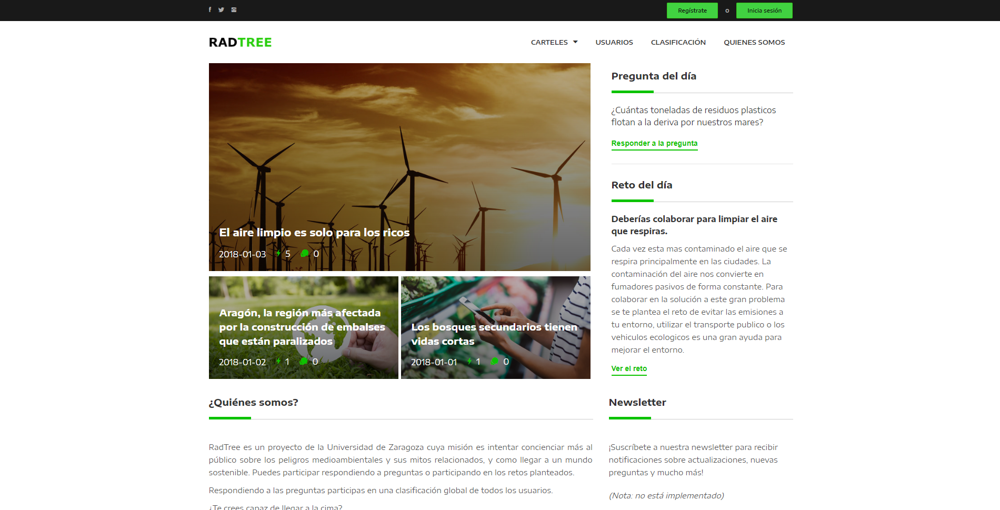
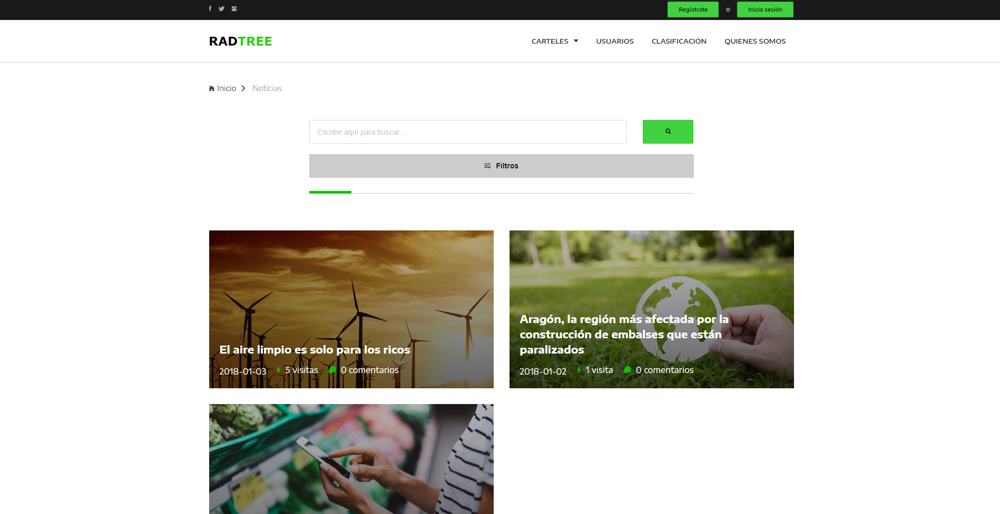
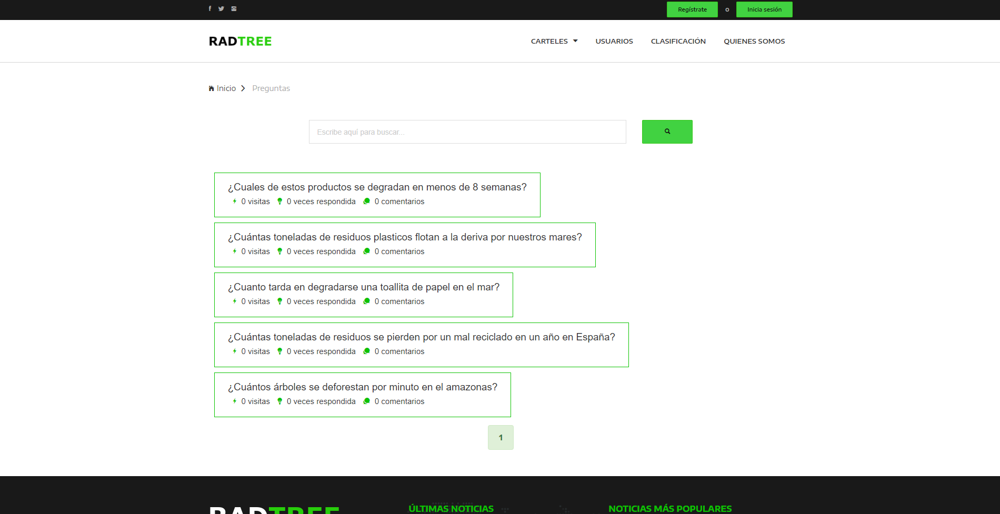
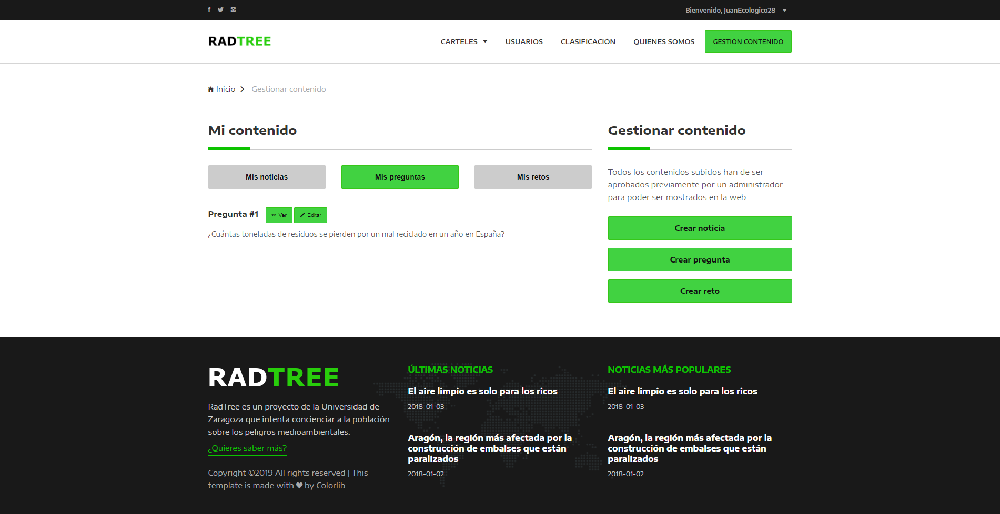
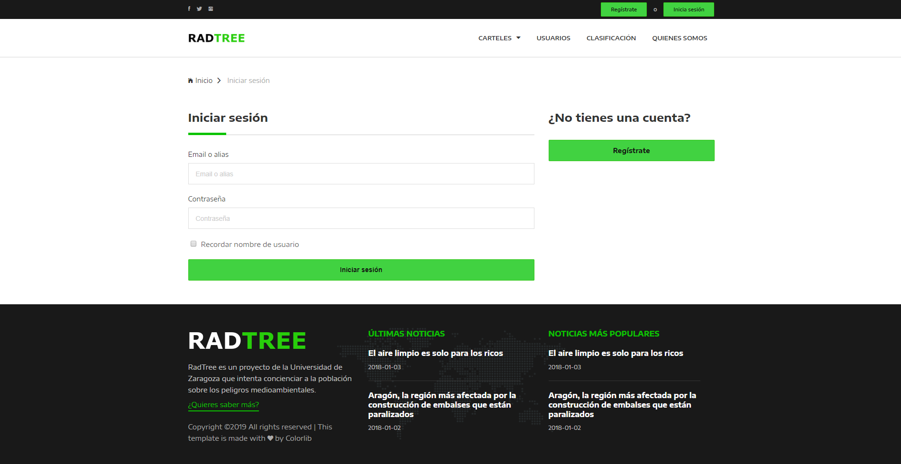
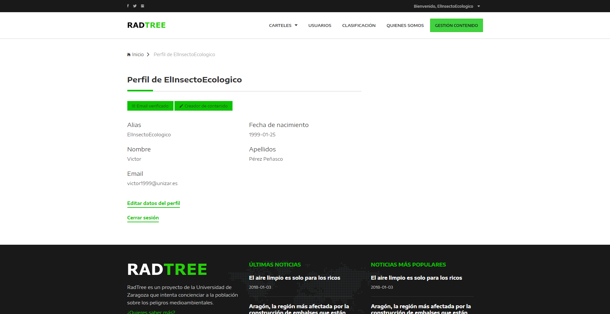
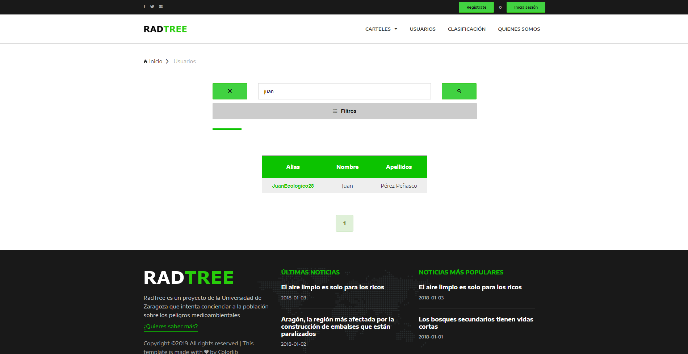
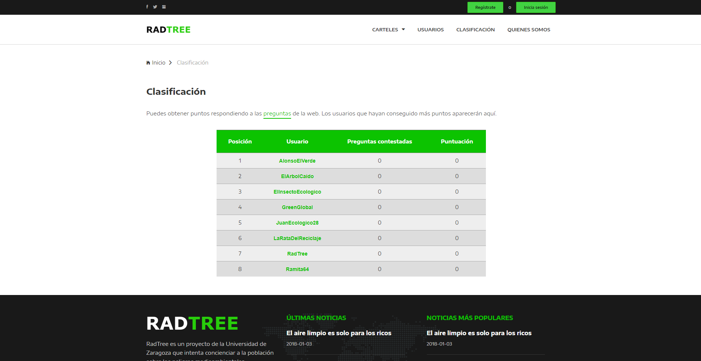

# RadTree

Prácticas de Sistemas de Información 2018-19, con temática de medio ambiente.

**Autores:**
- Diego Royo Meneses (<740388@unizar.es>)
- Alonso Muñoz García (<745016@unizar.es>)
- Gregorio Largo Mayor (<746621@unizar.es>)

Aplicación web desarrollada con JEE para su uso en Apache Tomcat, con capa de datos provista por un SBGD MySQL.

RadTree es un portal donde los usuarios registrados pueden subir contenido relacionado con el medio ambiente. Este contenido puede consistir de:
  - **Noticias:** artículos de interés, resumidos.
  - **Preguntas:** si son respondidas correctamente, el usuario gana puntos y con ellos puede competir con el resto de miembros en la clasificación global.
  - **Retos:** propuestas de mejora, con el objetivo de ser más respetuoso con el medio ambiente.

Otras características principales de la aplicación son:
  - Registro e inicio de sesión
  - Verificación del email asociado a la cuenta
  - Búsqueda de usuarios
  - Clasificación global de usuarios según puntos obtenidos y preguntas contestadas
  - Portal de gestión de contenido, donde los usuarios autorizados pueden crear y subir nuevas noticias, preguntas o retos
    - Inicialmente, este contenido debe pasar una aprobación por parte de los administradores antes de aparecer como público
  - Cola de validación, donde los usuarios administradores gestión ver el contenido pendiente de aprobación
  - Búsqueda y filtrado del contenido
  - Paginación
  - Sección de comentarios para cada entrada

## Vistas de la aplicación

Algunas de las vistas definitivas del proyecto son:

### Vista de bienvenida

### Lista de noticias

### Lista de preguntas

### Portal de gestión de contenido

### Inicio de sesión

### Perfil de usuario

### Búsqueda de usuarios

### Clasificación de usuarios

